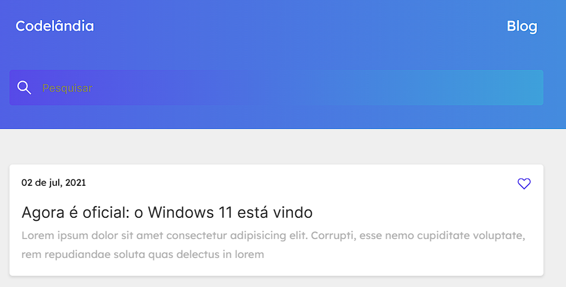

  

## Projeto Desafio 1 - Codelândia - 📷
Projeto feito e distribuido por Iuri Silva  para a comunidade codelândia. Repliquei o projeto conforme listava o desafio no figma para treinar HTML e CSS e algum script. Projeto totalmente responsivo e com um script de animação.

## Tecnologias - 👨‍💻
- HTML 
- CSS
- JavaScript
- Git e Github